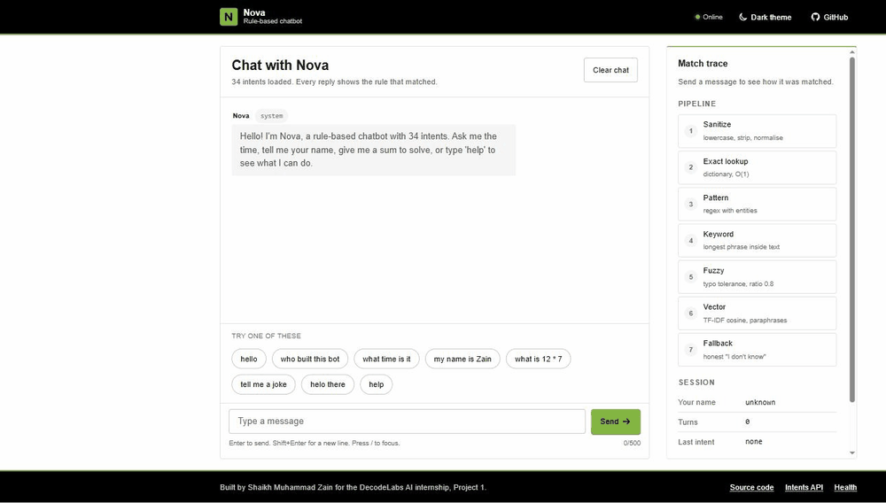

# Nova, a rule-based chatbot

DecodeLabs Industrial Training Kit, Artificial Intelligence, Project 1.

Live demo: [nova-rule-based-chatbot.vercel.app](https://nova-rule-based-chatbot.vercel.app)

Nova is a chatbot that answers with rules instead of a model. Every reply can be traced to a line in `intents.json`, which is the point of the project: before building systems that learn, build one you can fully explain. The terminal version is the graded deliverable. The web version wraps the same class in a small Flask API and shows the matching trace next to every reply.




## What it does

- Understands 34 intents: greetings, small talk, the time and date, arithmetic, jokes, coin flips, remembering your name, and an honest fallback when nothing matches.
- Matches input in five tiers, cheapest first: exact dictionary lookup, regex patterns with entity extraction, keyword search inside longer sentences, fuzzy matching for typos, and a TF-IDF vector tier for paraphrases.
- Keeps per-session memory: your name, the last reply (so "say that again" works), and the turn count.
- Normalises chat shorthand before matching, so "whats ur name" and "What's your name?" hit the same rule.
- Returns a confidence score and the tier that matched, which the web interface displays on every message.
- Has no dependencies outside the Python standard library. Flask is only needed for the web version.

## How a message is handled

```
"Hey Nova, whats ur name??"
        |
        v
  sanitize_input()      -> "hey what's your name"
        |                  lowercase, strip punctuation, expand shorthand,
        |                  drop filler words such as the bot's own name
        v
  match_intent()
    1. exact    intent_map["hey what's your name"]      -> miss
    2. pattern  regexes for names and arithmetic         -> miss
    3. keyword  longest known phrase inside the text     -> "what's your name"  (intent: name, 0.82)
    4. fuzzy    difflib against every phrase             -> (not reached)
    5. vector   TF-IDF cosine over every phrase          -> (not reached)
        |
        v
  handler (if the intent needs one: time, date, math, memory)
        |
        v
  pick a response template, fill {bot_name}, {user_name}, {time} ...
        |
        v
  "I'm Nova, a rule-based chatbot."
```

Each tier costs more than the one before it, and each is tried only if the previous one missed. The exact tier is a single dictionary lookup, so the common case stays O(1) no matter how many intents are loaded. Pattern-tier regexes carry named groups that become entities (`{"name": "zain"}`, `{"expr": "12 * 7"}`). The keyword tier prefers the longest phrase it finds, so "hi what time is it" resolves to `time` and not `greeting`. The fuzzy tier uses `difflib` with a 0.8 cutoff, never looks at words shorter than four letters, and checks each swapped word on its own, so "helo" counts as "hello" but "what" is never accepted as "that".

The vector tier is for messages that mean the same thing as a known phrase without sharing its wording: "could you tell me what the hour is" reaches `time` through "tell me the time". Every phrase is a TF-IDF vector over its words after synonym substitution (`hour` becomes `time`, `laugh` becomes `joke`), and the message is scored by cosine similarity. A match needs a similarity of 0.55, at least one shared content word (not a stopword, and not a word that appears in more than 5% of phrases), and the shared words must account for half of the phrase's weight. Those three guards are what stop "tell me" alone from matching "tell me a joke".

Arithmetic is evaluated by walking a Python AST with a whitelist of number and operator nodes. `eval()` is never called.

## Quick start

Requires Python 3.10 or newer.

```bash
git clone https://github.com/ZainDev04/Rule-based-chatbot.git
cd Rule-based-chatbot
python chatbot.py
```

Useful flags:

```bash
python chatbot.py --debug             # print the match trace after every reply
python chatbot.py --log chat.jsonl    # append every turn to a JSON lines file
python chatbot.py --list-intents      # print the loaded intents and exit
python chatbot.py --name Ada          # rename the bot
```

A session with `--debug`:

```
Nova: Hello! I'm Nova, a rule-based chatbot with 34 intents.
Nova: Type 'help' to see what I can do, or 'exit' to leave.

You: helo there
  [trace] cleaned='helo there' tier=fuzzy intent=greeting confidence=0.95 phrase='hello there' entities={}
Nova: Hi there! What can I do for you?
You: my name is zain
  [trace] cleaned='my name is zain' tier=pattern intent=remember_name confidence=0.95 phrase='my name is zain' entities={'name': 'zain'}
Nova: Nice to meet you, Zain! I'll remember that.
You: what is 2 to the power of 10
  [trace] cleaned='what is 2 to the power of 10' tier=pattern intent=math confidence=0.95 phrase='what is 2 to the power of 10' entities={'expr': '2 to the power of 10'}
Nova: 2 to the power of 10 = 1024
You: bye
Nova: Goodbye! Have a great day.
```

## Web interface

```bash
pip install -r requirements.txt
cd web
python app.py
```

Open `http://127.0.0.1:5000`. The page shows the chat on the left and a match trace on the right (a bottom sheet on phones). The trace stays quiet until the first reply; after that it shows raw and cleaned input, the tier that matched, the intent, the matched phrase, a confidence meter, extracted entities and server processing time, and the pipeline diagram lights up the step that produced the answer. The Trace button in the header hides the column on wide screens and the choice is remembered. "Browse all 34 intents" opens a dialog with one phrase per intent and a filter box.

The interface follows the Renovast design tokens (Helvetica Neue, 16px base, 4px radius, green accent, black header and footer) and is documented in [docs/DESIGN_SYSTEM.md](docs/DESIGN_SYSTEM.md). It works from 320px wide upwards, keeps the message box on screen at every size (only the conversation scrolls), supports light and dark themes, and every control is reachable with the keyboard.

### API

| Method | Route | Body | Returns |
|---|---|---|---|
| POST | `/api/chat` | `{"message": "hello", "session_id": "..."}` | reply, intent, tier, confidence, cleaned input, entities, session state, processing time |
| POST | `/api/reset` | `{"session_id": "..."}` | `{"reset": true, "existed": bool}` |
| GET | `/api/intents` | | count and a summary of every intent |
| GET | `/api/health` | | uptime, sessions, requests served, fallback rate |

Messages over 500 characters return 413, malformed bodies return 400, and more than 60 requests a minute from one client return 429. Errors are JSON with a `code` and a `message`.

Sessions live in memory on the server, expire after an hour idle, and are capped at 500. Every reply also returns the session state (`user_name`, `last_intent`, `last_reply`, `turn_count`), and the browser sends it back as `session_state` on the next request. That keeps memory working on serverless hosts such as Vercel, where two requests in a row may run in different processes.

```bash
curl -s -X POST https://nova-rule-based-chatbot.vercel.app/api/chat \
  -H "Content-Type: application/json" \
  -d '{"message": "hey what time is it", "session_id": "readme-example"}'
```

```json
{
  "bot_name": "Nova",
  "cleaned_input": "hey what time is it",
  "confidence": 0.82,
  "entities": {},
  "intent": "time",
  "matched_phrase": "what time is it",
  "processing_ms": 0.256,
  "raw_input": "hey what time is it",
  "response": "The current time is 3:43 PM (PKT).",
  "session": {
    "last_intent": "time",
    "last_reply": "The current time is 3:43 PM (PKT).",
    "started_at": "2026-09-18T15:40:02.118453+05:00",
    "turn_count": 1,
    "user_name": null
  },
  "session_ended": false,
  "session_id": "readme-example",
  "tier": "keyword"
}
```

`tier` and `matched_phrase` say which rule fired and why, `confidence` is 1.0 for an exact hit and lower for the looser tiers, and `session` is what the browser sends back on the next turn.

## Project structure

```
rule-based-chatbot/
├── chatbot.py              engine and terminal runner
├── intents.json            knowledge base: 34 intents, patterns, responses, synonyms, stopwords
├── requirements.txt        Flask (runtime)
├── requirements-dev.txt    adds pytest
├── wsgi.py                 root entrypoint for Vercel
├── vercel.json             keeps tests and docs out of the function bundle
├── tests/
│   ├── test_sanitize.py    input normalisation
│   ├── test_matching.py    exact, pattern, keyword and fuzzy tiers
│   ├── test_vector.py      vector tier and the fuzzy word check
│   ├── test_responses.py   handlers, memory, safe arithmetic, legacy helpers
│   └── test_api.py         Flask routes, validation, sessions
├── web/
│   ├── app.py              Flask application factory and API
│   ├── templates/index.html
│   └── static/style.css, script.js
├── docs/DESIGN_SYSTEM.md   tokens, component states, accessibility criteria
└── .github/workflows/tests.yml
```

## Tests

```bash
pip install -r requirements-dev.txt
pytest -q
```

132 tests run in about a second. They cover sanitisation, every tier with positive and negative cases (including paraphrases the vector tier must catch and filler-only inputs it must reject), the safe evaluator (including inputs that try to escape it), session isolation, template filtering when the user's name is unknown, and every API route. One test walks every intent and checks that each of its own examples still reaches it, so a typo in `intents.json` fails CI.

## Adding an intent

Edit `intents.json`. A static intent needs a name, a description, patterns and responses:

```json
{
  "name": "farewell_soon",
  "description": "The user says they will leave shortly.",
  "patterns": ["i will go soon", "leaving in a bit"],
  "exact_only": ["soon"],
  "responses": ["No rush. I'll be here."]
}
```

`patterns` take part in every tier. `exact_only` phrases match only when they are the whole message, which is how short words such as "good" avoid matching inside unrelated sentences. Responses may use `{bot_name}` and `{user_name}`; templates that need a name are skipped until the user has given one.

An intent that needs computed data adds a `handler` name and a method on `RuleBasedChatbot` that returns the placeholder values. Pattern-tier intents add `regex` entries with named groups and, optionally, a `reject` list and a validator, which is how "i am tired" stays a mood instead of becoming a person called Tired.

## Design decisions

Why a JSON file instead of Python dictionaries: the graded version kept intents in code, so adding one meant editing logic. Moving them to data made the engine generic, made the file testable on its own, and let the web interface list intents without importing anything private.

Why four tiers instead of one big fuzzy match: fuzzy matching everything is slow and produces surprising hits. Trying the exact lookup first keeps the common path at one dictionary read, and each later tier only runs when the earlier ones fail. The tier name is returned with every reply, so the trade-off is visible instead of hidden.

Why an AST walker for arithmetic: `eval()` on user text is a remote code execution bug, even in a demo. Parsing to an AST and accepting only numbers and six operators gives the same result with no risk, and `test_safe_eval_rejects_non_arithmetic` makes sure it stays that way.

Why sessions travel with the browser: the demo runs on Vercel, where two requests in a row may land on different processes, so a server-side dictionary alone would forget the user's name. Each reply returns the session state and the browser sends it back. The server still keeps a dictionary as a cache, with idle expiry and a hard cap, and the newer copy wins. Moving the cache to Redis would be a change to two functions in `app.py`.

Why the trace panel: in an interview, the interesting part of a rule-based bot is the matching, not the replies. Showing the tier and confidence on every message turns the demo into an explanation.

Why TF-IDF for the vector tier and not a sentence embedding model: a small model such as `all-MiniLM-L6-v2` needs PyTorch, which puts the deployment at roughly 900 MB against Vercel's 500 MB function limit, adds seconds of cold start, and makes the reply depend on weights nobody can read. TF-IDF with a synonym table is 60 lines of standard-library Python, builds in a few milliseconds, gives a score that can be explained word by word, and lives in the same JSON file as everything else. It is a weaker matcher, and the limitations below say so.

## Usability review

After the first deployment the live page went through five rounds of an automated heuristics audit (Nielsen-style, scored out of 100). Each round produced a short list of findings; the ones that pointed at something real were fixed and the rest were noted. What changed as a result:

- Labels are sentence case instead of small caps, and the "system" tag on the welcome message got readable contrast.
- The conversation is anchored to the bottom of the log, so the greeting sits next to the suggestion chips and the message box instead of leaving a gap.
- The character counter only appears once there is something to count, and the keyboard hint has room under the box.
- The intent list used to be 99 example buttons inside the trace column. It is now a dialog with one row per intent, a filter, and lazy rendering, so the column stays short and the count matches the "34 intents" label.
- The pipeline steps are joined by a thread, the markers are outlined instead of boxed, and the notes are written in plain words ("close enough despite typos") rather than algorithm names.
- The trace column can be hidden, shows only one line until the first reply, and its heading sits level with the chat heading.
- The header brand, page heading and footer share one left edge on wide screens; the footer is a single centred stack.
- The message box is pinned on phones as well as on desktop.

Two lessons from the process. Automated auditors read the accessibility tree and measure boxes inside scroll containers, so an `aria-describedby` on the textarea was reported as duplicated text and the collapsed intent list was reported as 5000px of page. And some findings are artefacts of the auditor's own capture: the tool reported a "ghost" copy of the message box in every round, while full-page screenshots from headless Chrome at three viewport sizes show exactly one. Those were left alone.

## Deployment

The repository is set up for Vercel's Python preset: `wsgi.py` at the root exposes the Flask `app`, `requirements.txt` lists Flask, `.python-version` pins 3.12, and `vercel.json` excludes tests and docs from the function bundle.

1. Sign in at vercel.com with GitHub and choose "Add New Project".
2. Import `ZainDev04/Rule-based-chatbot`. Leave every setting at its default; Vercel detects Flask.
3. Deploy. Every later push to `main` redeploys automatically.

Or from the command line: `npm i -g vercel`, `vercel login`, then `vercel --prod` in the project folder.

Any other WSGI host works too: point it at `wsgi.py` (root) or `web.app:app`.

Time replies use Pakistan Standard Time (UTC+5) explicitly because the server runs in UTC.

## Limitations and next steps

- The vector tier only knows the synonyms it is given. "Could you tell me what the hour is" works because `hour` is mapped to `time`; a paraphrase that uses none of the listed words still falls back. A sentence embedding model behind the vector tier, used only when its score is low and served from a host with no bundle limit, is the natural next step.
- Context is one turn deep. Multi-turn slot filling ("book a table", "for when?") would need a state machine on top of the session.
- The knowledge base is English only. The normalisation map is the natural place to add transliterated Urdu shorthand.
- Sessions are lost on restart. Fine for a demo, not for a product.

## Author

Shaikh Muhammad Zain
AI intern, DecodeLabs (June 2026 batch)
Third-year Computer Science (AI specialisation), NED University of Engineering and Technology

MIT licence. See [LICENSE](LICENSE).
